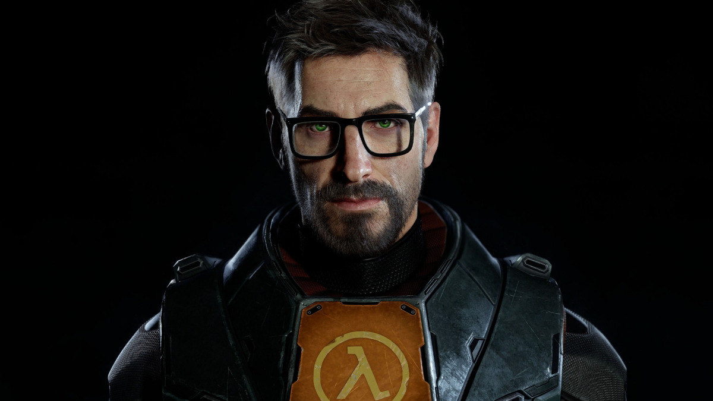

# Half-Life 3 (Early Access Build)


<div align="center">
  
</div>

> ⚠️ **Projeto humorístico/paródia.**  
> Este repositório NÃO contém código oficial da Valve ou do jogo Half-Life 3.  
> Tudo aqui é uma brincadeira técnica criada para fins educacionais e de entretenimento.

---

## 🇧🇷 Sobre o projeto

Vazamento exclusivo dos arquivos binários de *Half-Life 3* (😏).  
Este repositório contém um renderizador inicial de shaders e uma cinemática fictícia de introdução do G-Man em 4K, simulando uma build Alpha do jogo.

Nenhum conteúdo pertence à Valve. Este projeto é apenas uma paródia criada para diversão e aprendizado.

---

## 🇺🇸 About the project

Exclusive leak of *Half-Life 3* binary files (😏).  
This repository contains an early shader renderer and a fictional 4K G-Man intro cinematic, simulating an Alpha build of the game.

No content belongs to Valve. This project is a parody made for fun and educational purposes only.

---

## 🔧 Ajustes e melhorias | Improvements

O projeto ainda está em desenvolvimento e as próximas atualizações serão voltadas para:

- [x] Integração com motor MPV para cinemáticas  
- [x] Interface básica em PyQt6  
- [x] Sistema fake de "Compilação de Shaders"  
- [ ] Implementação do Ray Tracing (RTX)  
- [ ] Suporte para VR (Valve Index)  

---

## 💻 Pré-requisitos | Requirements

### PT-BR
Antes de começar, verifique se você possui:

- Sistema SteamOS ou Linux  
- Placa de vídeo compatível com Vulkan  
- Coragem para enfrentar o G-Man  

### EN
Before you start, make sure you have:

- SteamOS or Linux system  
- Vulkan-compatible GPU  
- Courage to face the G-Man  

---

## ☕ Usando | How to use

### PT-BR
Baixe o release mais recente na aba **Releases**, dê permissão de execução e rode:

```bash
chmod +x half_life_3
./half_life_3
```
> ⚠️ O processo de "Compilação de Shaders" pode levar alguns segundos. Não feche a janela até a introdução iniciar.

### EN
Download the latest release from the Releases section and run:

```bash
chmod +x half_life_3
./half_life_3
```
---

## 📫 Contribuindo | Contributing

PT-BR
- Faça um fork do repositório
- Crie um branch: git checkout -b feature/nova-feature
- Commit: git commit -m "Adicionando City 17"
- Push: git push origin feature/nova-feature
- Abra um Pull Request

EN
- Fork the repository
- Create a branch: git checkout -b feature/new-feature
- Commit: git commit -m "Add City 17"
- Push: git push origin feature/new-feature
- Open a Pull Request

---

🤝 Colaboradores | Contributors
<table> <tr> <td align="center"> <a href="https://github.com/ChaoticNoodley"> <br> <sub><b>ChaoticNoodley</b></sub> </a> </td> <td align="center"> <a href="https://github.com/WellytonSdJ"> <br> <sub><b>WellytonSdJ</b></sub> </a> </td> </tr> </table>

---

## 📝 Licença | License

Este projeto está sob a licença MIT (Black Mesa Parody License).
Veja o arquivo [LICENSE](LICENSE)
 para mais detalhes.

Este projeto não é afiliado à Valve Corporation.
