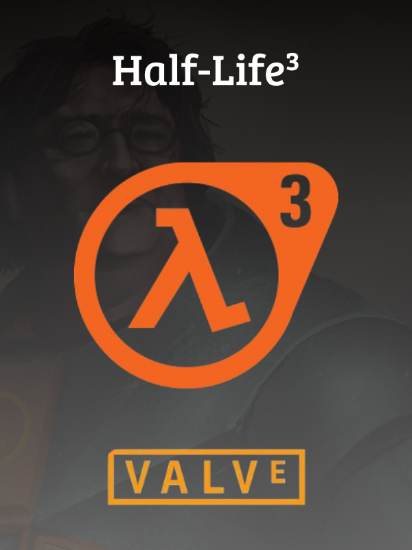

Half-Life 3 (Early Access Build)

Vazamento exclusivo dos arquivos binários de Half-Life 3. Este repositório contém o renderizador inicial de shaders e a cinemática de introdução do G-Man em 4K. Arquivos obtidos via acesso remoto aos servidores da Valve.

Ajustes e melhorias
O projeto está em fase Alpha e as próximas atualizações serão voltadas para as seguintes tarefas:

[x] Integração com motor MPV para cinemáticas

[x] Interface básica em PyQt6

[x] Sistema de "Compilação de Shaders" fake

[ ] Implementação do Ray Tracing (RTX)

[ ] Suporte para VR (Valve Index)

💻 Pré-requisitos
Para rodar a build pré-compilada, você só precisa de:

Uma máquina Windows ou Linux.

Placa de vídeo compatível com DirectX 12 / Vulkan (para os "shaders").

Coragem para enfrentar as consequências do G-Man.

🚀 Instalando Half-Life 3
Não é necessário configurar ambientes de desenvolvimento ou instalar Python. Para instalar o jogo, siga estas etapas:

Vá até a seção  deste repositório.

Baixe a versão mais recente do arquivo executável (.exe para Windows ou o binário para Linux).

Extraia o conteúdo (se estiver em .zip) para uma pasta de sua preferência.

☕ Usando Half-Life 3
Para iniciar a experiência, basta executar o arquivo:

Aviso: O processo de "Compilação de Shaders" pode levar alguns segundos dependendo do seu hardware. Não feche a janela até que a introdução comece.

📫 Contribuindo para HL3
Para contribuir com o desenvolvimento da Source 3 Engine, siga estas etapas:

Bifurque este repositório.

Crie um branch: git checkout -b feature/novo-mapa.

Faça suas alterações e confirme-as: git commit -m 'Adicionando City 17'

Envie para o branch original.

🤝 Colaboradores
<table>
<tr>
<td align="center">
<a href="" title="Perfil de ChaoticNoodley">

<b>ChaoticNoodley</b>

</a>
</td>
<td align="center">
<a href="" title="Perfil de WellytonSdJ">

<b>WellytonSdJ</b>

</a>
</td>
<td align="center">
<a href="#" title="Valve Boss">

<b>Gabe Newell</b>

</a>
</td>
</tr>
</table>

📝 Licença
Esse projeto está sob a licença "Black Mesa". Veja o arquivo  para mais detalhes.
